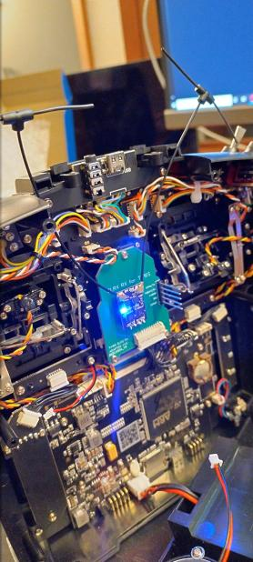

# RX as TX adapter board for TX16S

## Assembly
You'll need to order PCBs from the folder named `gerber`. I used JLCPCB and their cheapest options, and all worked just fine.
### Parts
* Molex 538-53048-1210 connector for the TX16S internal connection (available on Mouser https://www.mouser.com/ProductDetail/Molex/53048-1210)
* 25mm long 2.54mm pitch dupont-style connectors (available on Amazon https://www.amazon.com/dp/B07DK4BDHK)
* Short 2.54mm pitch dupont-style connectors (I used some round-pin versions I had lying around https://www.amazon.com/gp/product/B00Y80U9C2). You could also just trim down regular ones once the RX is soldered in.

Insert the pins & connectors all facing up, and solder up. I found that the 53048-1210 connector was easy enough to do with a fine tip soldering iron, but solder paste and a hot air gun made it about 10x easier.

Make sure you haven't created any solder bridges on the 53048-1210 connector, it's really easy to do and will cause major problems.

## Flashing
Take a Unified ESP32 TX firmware image from the ExpressLRS project. You can use the ones built by their [GitHub Actions](https://github.com/expresslrs/expresslrs/actions). Either pick a particular commit / branch by using the search function on the top-right, or just select the latest master commit if you're up for it. Go to the Artifacts section at the bottom of a particular Actions run and download the `firmware` artifact. Inside that ZIP file, find `FCC/Unified_ESP32_2400_TX/firmware.bin` and flash that to your RX via WiFi or FTDI adapter.

Once that image is flashed, reboot the RX. It should come up as a TX module awaiting hardware configuration. Upload the JSON file from this repository (in the `json` folder) and save settings.

## Warnings
* The JSON file provided allows the system to run at up to 100mW. It's not recommended to let it run this high without some form of cooling while inside a TX16S. 
* Check again for solder bridges before you plug this board in. If you don't, you'll need to replace the inductor on the back of your TX16S mainboard (ask me how I know).
